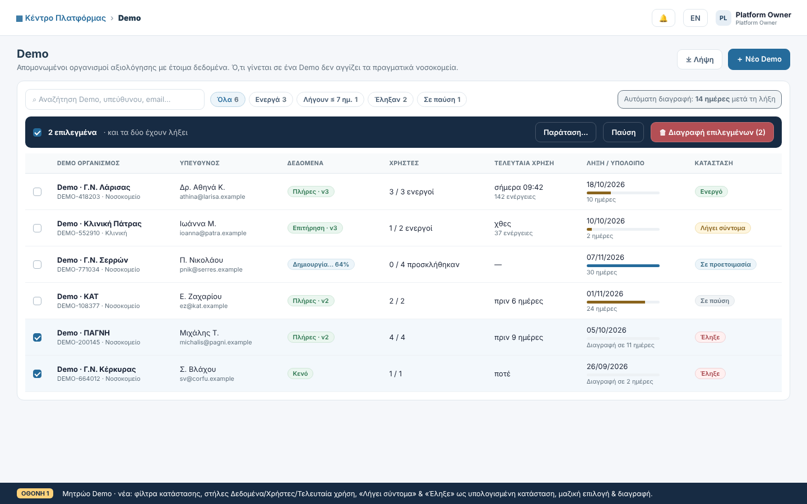
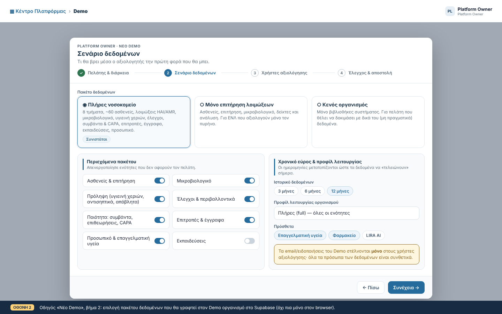
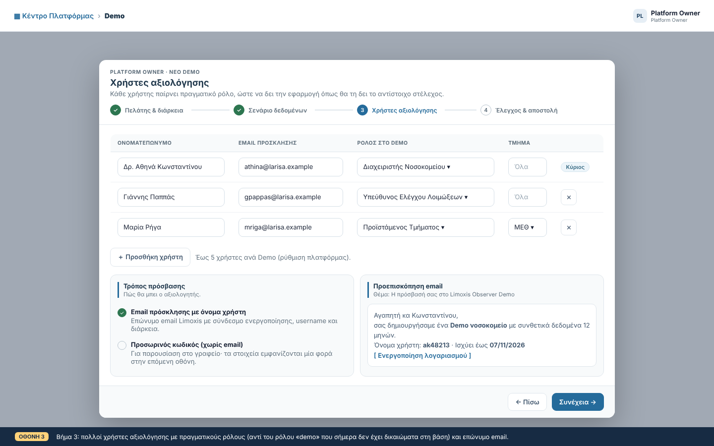
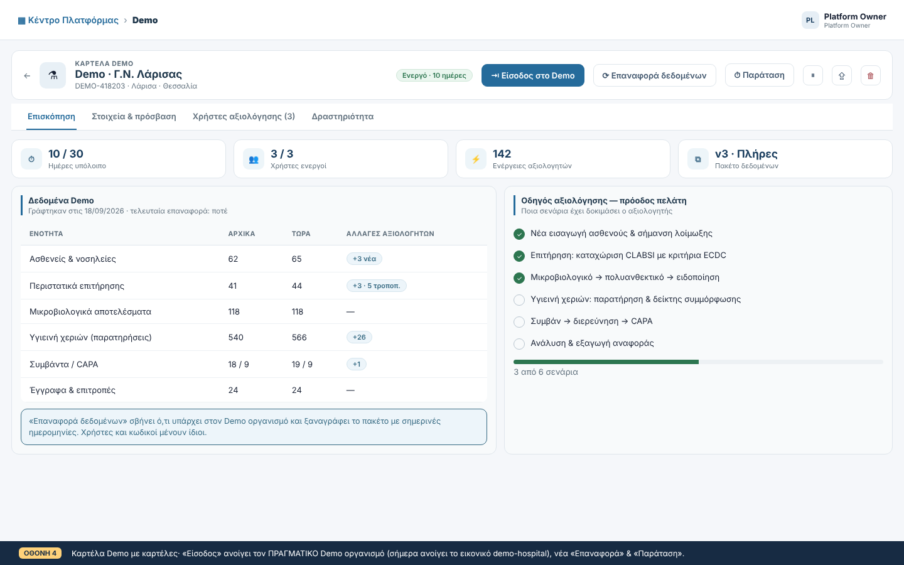
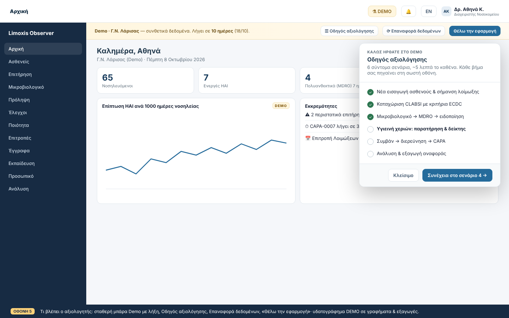
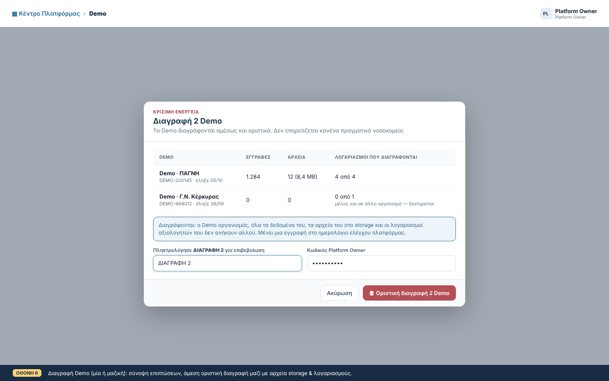
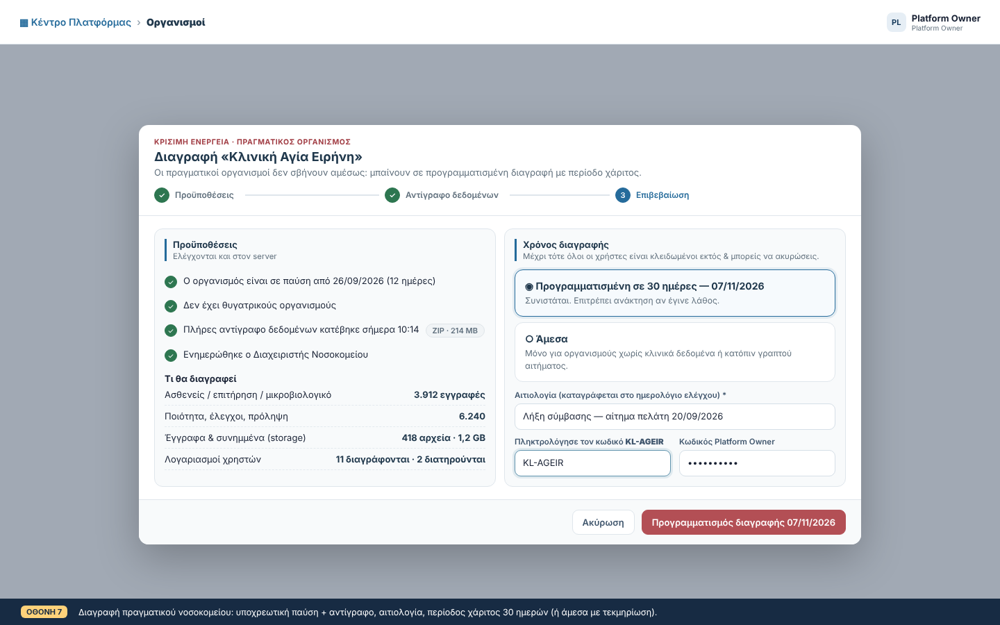
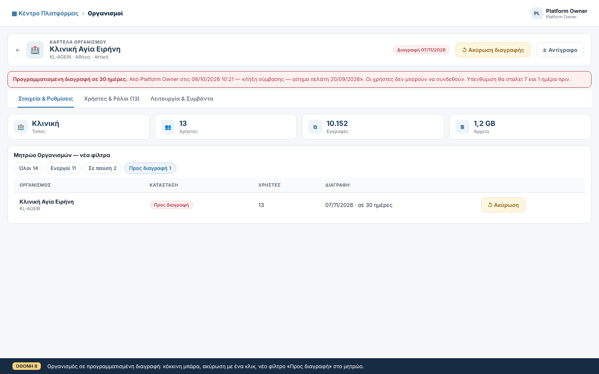
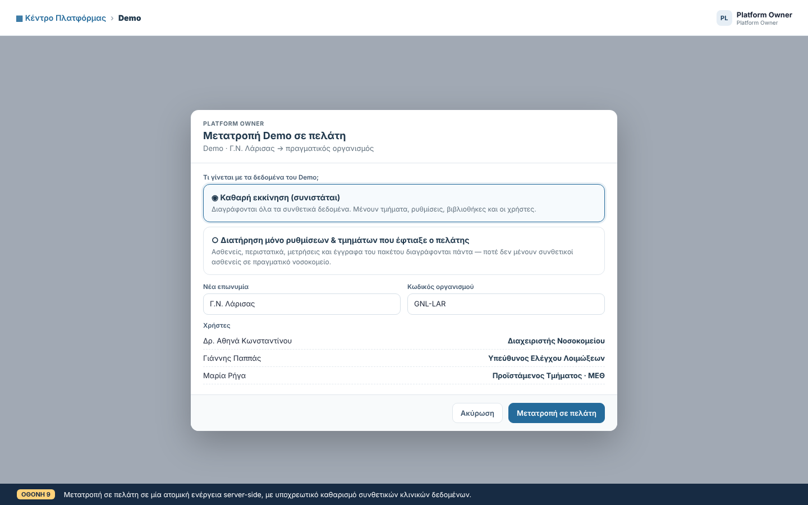

# Demo αξιολόγησης & διαγραφή οργανισμών: σχεδιασμός

Κατάσταση: **Πρόταση προς έγκριση** · 08/10/2026
Mockups: [`docs/design/demo-lifecycle/`](./design/demo-lifecycle/) (PNG ανά οθόνη και `mockups.html`)

## 1. Στόχος

1. Ο Platform Owner δημιουργεί **Demo νοσοκομείο** για υποψήφιο πελάτη. Ο πελάτης μπαίνει με δικό του λογαριασμό και αξιολογεί την εφαρμογή **με ρεαλιστικά, έτοιμα δεδομένα**.
2. Τα Demo έχουν πλήρη κύκλο ζωής: δημιουργία, χρήση, παράταση, επαναφορά, λήξη, μετατροπή σε πελάτη και διαγραφή.
3. Ο Platform Owner μπορεί να **διαγράψει Demo** (ένα ή πολλά μαζί), αλλά και **πραγματικά νοσοκομεία**. Τα πραγματικά διαγράφονται με αυστηρότερες δικλίδες.

## 2. Σημερινή κατάσταση: τι βρήκαμε στον κώδικα

Σήμερα η λέξη «Demo» σημαίνει **δύο ασύνδετα πράγματα**:

| | (A) Demo λογαριασμός (server) | (B) Demo mode (browser) |
|---|---|---|
| Πού | `create-demo-access` → `organizations.is_demo=true` + `platform_demo_entitlements` + χρήστης με ρόλο `demo` | `TenantContext` `DEMO_TENANT='demo-hospital'` + `*DemoData.js` fixtures |
| Δεδομένα | **Κενός οργανισμός** (μόνο βιβλιοθήκες συστήματος) | Πλούσια συνθετικά δεδομένα, μόνο στη μνήμη· το refresh τα επαναφέρει |
| Ποιος το βλέπει | Ο υποψήφιος πελάτης | Μόνο ο Platform Owner (`enterPlatformDemo`) |

Κύρια προβλήματα:

- **Ο πελάτης αξιολογεί άδειο νοσοκομείο.** Τα πλούσια δεδομένα τα βλέπει μόνο ο Owner. Επιπλέον, το κουμπί «Είσοδος» στην καρτέλα Demo ανοίγει το εικονικό `demo-hospital` και όχι τον οργανισμό του συγκεκριμένου Demo (`PlatformCenterPage.jsx:73`).
- **Ο ρόλος `demo` δεν έχει δικαιώματα στη βάση.** Στον browser έχει όλα τα capabilities (`systemRoleMatrix.js`), ενώ στο `role_capabilities` δεν έχει κανένα. Η οθόνη επιτρέπει ενέργειες που το RLS απορρίπτει.
- **Η λήξη δεν επιβάλλεται.**
  - Κανένα RLS και καμία προγραμματισμένη εργασία δεν ελέγχουν τις ημερομηνίες.
  - Ο έλεγχος στο `AuthContext` διαβάζει το `platform_demo_entitlements`, που επιτρέπεται μόνο στον Owner, οπότε για τον πελάτη πιθανότατα δεν λειτουργεί.
  - Το `accept-account-invitation` επιτρέπει ενεργοποίηση ακόμη και σε Demo που έχει λήξει.
- **Δεν υπάρχει καθαρισμός.** Τα ληγμένα Demo μένουν για πάντα, μαζί με τον οργανισμό, τους χρήστες και τα αρχεία τους.
- **Η μετατροπή σε πελάτη γίνεται σε 4 ξεχωριστά βήματα από τον browser**, χωρίς ατομικότητα (transaction).
- **Η διαγραφή οργανισμού (`platform_purge_organization_tx`)**:
  - Εκτελεί ένα `DELETE organizations` και στηρίζεται στο CASCADE. Το trigger `guard_finalized_ast_mutation` πιθανότατα το μπλοκάρει όταν υπάρχουν οριστικοποιημένα αντιβιογράμματα. Τα `patient_id ... ON DELETE RESTRICT` μπορεί επίσης να το σταματήσουν.
  - **Δεν σβήνει αρχεία από το storage**, δηλαδή από τα buckets `attachments` και `laboratory-attachments`.
  - Παρακάμπτεται εύκολα:
    - με απευθείας κλήση του RPC (χωρίς επανέλεγχο κωδικού),
    - με απευθείας `DELETE /organizations` (policy `organizations_platform_owner_delete`, το χρησιμοποιεί το `deletePlatformDemo`).
  - Δεν απαιτεί προηγούμενη παύση, αντίγραφο δεδομένων ή περίοδο χάριτος.
  - Συγκρούεται με τον κανόνα 7 του `AUTHORIZATION_MODEL.md` (τα οριστικοποιημένα στοιχεία τεκμηρίωσης δεν διαγράφονται φυσικά).
- **Η παύση οργανισμού επιβάλλεται μόνο στον browser.** Το RLS δεν ελέγχει το `organizations.status`.
- **Λείπει καταγραφή στο audit** για τη δημιουργία, αλλαγή και παύση οργανισμών και για τη διαγραφή λογαριασμών μετά το purge.

## 3. Αρχές σχεδιασμού

1. **Ένα Demo = ένας πραγματικός, απομονωμένος οργανισμός στο Supabase με γραμμένα δεδομένα.** Ο αξιολογητής χρησιμοποιεί **τον ίδιο κώδικα και τις ίδιες οθόνες με την παραγωγή**, οπότε αξιολογεί το πραγματικό προϊόν. Το client-side Demo mode (B) μένει μόνο για την προεπισκόπηση του Owner και του Help, και σταδιακά καταργείται.
2. **Το «Demo» είναι ιδιότητα του οργανισμού, όχι ρόλος.** Οι αξιολογητές παίρνουν πραγματικούς ρόλους (Διαχειριστής, ΕΝΛ, Ποιότητα, Προϊστάμενος…). Ο ρόλος `demo` καταργείται.
3. **Η βάση είναι το σύνορο.** Η λήξη, η παύση και η διαγραφή επιβάλλονται σε RLS, σε SECURITY DEFINER συναρτήσεις και σε edge functions, όχι στην οθόνη.
4. **Μία πόρτα για τη διαγραφή.** Κάθε διαγραφή περνά από μία edge function, με επανέλεγχο κωδικού, καταγραφή στο audit και καθαρισμό του storage. Οι παρακαμπτήριες διαδρομές κλείνουν.
5. **Τα Demo είναι αναλώσιμα· τα πραγματικά νοσοκομεία όχι.** Τα Demo διαγράφονται αμέσως ή αυτόματα. Τα πραγματικά διαγράφονται μόνο μετά από παύση, αντίγραφο και περίοδο χάριτος.

## 4. Κύκλος ζωής

```
                 ┌────────────── Επαναφορά δεδομένων ─────────────┐
                 ▼                                                │
 [Σε προετοιμασία] ──seed ok──► [Ενεργό] ──λήξη──► [Έληξε] ──+N ημ.──► (αυτόματη διαγραφή)
        │ seed fail                │  ▲                 │
        ▼                          ▼  │ επανενεργ.      │ παράταση
     [Αποτυχία] ◄── retry      [Σε παύση]            [Ενεργό]
                                   │
     Ενεργό / Σε παύση / Έληξε ──Μετατροπή──► πραγματικός οργανισμός (is_demo=false)
     οποιαδήποτε κατάσταση ──Διαγραφή──► διαγράφεται αμέσως
```

Οι καταστάσεις «Λήγει σύντομα» (≤ 7 ημέρες) και «Έληξε» **υπολογίζονται** σε ένα view (`platform_demo_overview`). Επιπλέον, μια νυχτερινή εργασία γράφει `status='expired'` για όσα έληξαν, ώστε να ισχύει παντού το ίδιο αποτέλεσμα.

Πραγματικοί οργανισμοί:

```
[Ενεργός] ⇄ [Σε παύση] ──Προγραμματισμός διαγραφής──► [Προς διαγραφή] ──30 ημ.──► (purge)
                                   ▲                         │
                                   └──── Ακύρωση διαγραφής ──┘
```

## 5. Ροή δημιουργίας Demo (Owner)

Η σημερινή ενιαία φόρμα γίνεται οδηγός 4 βημάτων:

1. **Πελάτης & διάρκεια.** Τα σημερινά πεδία: επωνυμία, τύπος, περιφέρεια, ΥΠΕ, πόλη, κλίνες, υπεύθυνος, έναρξη και λήξη (προεπιλογή `default_demo_duration_days`).
2. **Σενάριο δεδομένων** (Οθόνη 2):
   - Πακέτο: *Πλήρες νοσοκομείο*, *Μόνο επιτήρηση* ή *Κενό*.
   - Διακόπτες ανά ενότητα.
   - Ιστορικό 3, 6 ή 12 μηνών.
   - Προφίλ λειτουργίας και πρόσθετα (`operating_profile`, `enabled_addons`).
3. **Χρήστες αξιολόγησης** (Οθόνη 3):
   - 1 έως N χρήστες (ρύθμιση πλατφόρμας `max_demo_users`, προεπιλογή 5), ο καθένας με πραγματικό ρόλο και προαιρετικά τμήμα.
   - Τρόπος πρόσβασης: επώνυμο email πρόσκλησης, ή προσωρινός κωδικός που εμφανίζεται μία φορά (για παρουσίαση).
4. **Έλεγχος & αποστολή.** Σύνοψη και προεπισκόπηση του email.

Στο server, η `create-demo-access` ξαναγράφεται ώστε να είναι **ασύγχρονη και ατομική**:

1. Μία RPC `platform_create_demo_tx(payload)` (SECURITY DEFINER, μόνο Owner) δημιουργεί σε **ένα transaction**:
   - τον οργανισμό, με `is_demo=true`,
   - το entitlement, με `seed_status='pending'`,
   - τα invitations.
2. Η edge function στέλνει τα invites και ενημερώνει τα `profiles`. Σε αποτυχία καλεί την RPC διαγραφής, ώστε να μη μένουν ορφανά.
3. Το seeding τρέχει **ασύγχρονα** στη νέα function `seed-demo-organization`. Η πρόοδος (%) φαίνεται στο μητρώο ως «Σε προετοιμασία 64%» (Οθόνη 1). Τα email φεύγουν **μόνο όταν το seed ολοκληρωθεί**, ώστε ο πελάτης να μη μπει σε άδειο νοσοκομείο.
4. Χρησιμοποιείται το επώνυμο πρότυπο `demoAccessEmail()` (`_shared/emailTemplates.ts`), που σήμερα δεν χρησιμοποιείται. Θα περιλαμβάνει username, λήξη και σύνδεσμο ενεργοποίησης.

## 6. Δεδομένα Demo: πακέτο & seeding

**Μία πηγή αλήθειας.** Τα σημερινά `*DemoData.js` (patients, surveillance, laboratory, prevention, controls, quality, employees, indicators, pharmacy, clinical-scales, analysis, management) μεταφέρονται σε ένα **versioned πακέτο δεδομένων**:

- `supabase/functions/_shared/demoSeed/pack.v1.json`: οντότητες με **συμβολικά ids** (π.χ. `patient:p01`) και **σχετικές ημερομηνίες** (π.χ. `"admittedAt": "-42d"`).
- `tools/build-demo-seed-pack.mjs`: παράγει το pack από τα fixtures.
- Νέο `audit:demo-seed-parity`: αποτυγχάνει αν fixtures και pack αποκλίνουν, ή αν ένα πεδίο του pack δεν υπάρχει πια στο schema.

**Seeder (`seed-demo-organization`, service role):**

1. Ελέγχει ότι `organizations.is_demo = true`. Αρνείται να γράψει σε πραγματικό οργανισμό, και αυτό ελέγχεται **και** μέσα στη SECURITY DEFINER `private.assert_demo_org(org_id)`.
2. Γράφει με σειρά εξαρτήσεων: τμήματα → προσωπικό → ασθενείς/νοσηλείες → επιτήρηση → μικροβιολογικό/AST → πρόληψη → έλεγχοι → ποιότητα/CAPA → επιτροπές/έγγραφα → εκπαιδεύσεις → δείκτες.
3. Αντιστοιχίζει τα συμβολικά ids σε νέα UUID και μετατρέπει τις σχετικές ημερομηνίες σε απόλυτες, με βάση τη «σήμερα» και το επιλεγμένο ιστορικό.
4. Τα AST γράφονται πρώτα ως `draft` και οριστικοποιούνται στο τέλος, ώστε να μην μπλοκάρει το `guard_finalized_ast_mutation`.
5. Ανεβάζει δείγματα συνημμένων (PDF, εικόνες) στο `attachments/{orgId}/demo/…`.
6. Γράφει `seed_status`, `seed_progress`, `seed_version`, `seeded_at` και μετρητές ανά ενότητα στο `platform_demo_seed_runs`. Από εκεί προκύπτει ο πίνακας «Αρχικά / Τώρα» της Οθόνης 4.
7. Είναι επαναλήψιμος: η **Επαναφορά δεδομένων** εκτελεί `private.demo_wipe_data(org_id)` και μετά ξανά το seed.

**`private.demo_wipe_data(org_id)`:**

- Διαγράφει τα δεδομένα λειτουργίας του οργανισμού με ρητή σειρά, ώστε να μη χτυπήσουν τα RESTRICT foreign keys.
- Χρησιμοποιεί `set local limoxis.test_reset='on'` για τα guards των AST.
- **Κρατά** οργανισμό, μέλη, τμήματα και ρυθμίσεις.
- Επιτρέπεται **μόνο** όταν `is_demo = true`.
- Η ίδια συνάρτηση χρησιμοποιείται και στη μετατροπή σε πελάτη (§10).

**Ειδοποιήσεις/email από Demo.** Το `process-notification-outbox` στέλνει σε Demo οργανισμό **μόνο** σε email χρηστών αξιολόγησης. Δεν στέλνει ποτέ σε διευθύνσεις των συνθετικών προσώπων. Όλα τα email των συνθετικών προσώπων είναι `@example.invalid`.

## 7. Χρήστες αξιολόγησης & δικαιώματα

- Οι αξιολογητές γίνονται `organization_members` με **πραγματικό ρόλο**. Το `profiles.is_demo` μένει μόνο ως ένδειξη.
- Ο ρόλος `demo` αφαιρείται από τη δημιουργία. Για τα υπάρχοντα μέλη με ρόλο `demo` γίνεται migration σε `hospital_admin` μέσα σε Demo οργανισμούς.
- Ο Owner βλέπει και διαχειρίζεται τους αξιολογητές στην καρτέλα «Χρήστες αξιολόγησης» (επαναποστολή, reset κωδικού, προσθήκη, αφαίρεση), με επαναχρησιμοποίηση του `manage-organization-user`.
- Αν ένας αξιολογητής είναι ήδη χρήστης άλλου οργανισμού, απλώς προστίθεται ως μέλος. Δεν φτιάχνεται δεύτερος λογαριασμός.

## 8. Εμπειρία αξιολογητή (Οθόνη 5)

- **Σταθερή μπάρα Demo** πάνω από το περιεχόμενο. Δείχνει όνομα Demo, ημέρες που απομένουν και τρία κουμπιά:
  - **Οδηγός αξιολόγησης**,
  - **Επαναφορά δεδομένων** (μόνο για Διαχειριστή του Demo, με επιβεβαίωση),
  - **Θέλω την εφαρμογή**: στέλνει αίτημα στον Owner, ως ειδοποίηση στο Κέντρο Πλατφόρμας και email.
- **Οδηγός αξιολόγησης.** Λίστα 6 σεναρίων, καθένα με deep-link στη σωστή οθόνη:
  1. εισαγωγή ασθενούς,
  2. CLABSI με κριτήρια ECDC,
  3. μικροβιολογικό → MDRO,
  4. υγιεινή χεριών,
  5. συμβάν → CAPA,
  6. ανάλυση & εξαγωγή.

  Ανοίγει αυτόματα στην πρώτη είσοδο. Η πρόοδος αποθηκεύεται (`demo_evaluation_progress`) και ο Owner τη βλέπει στην Οθόνη 4.
- **Υδατογράφημα «DEMO»** σε γραφήματα, εκτυπώσεις, PDF και Excel εξαγωγές του Demo οργανισμού.
- **Όταν λήξει**, η σύνδεση οδηγεί σε οθόνη «Το Demo έληξε» με κουμπί «Ζητήστε παράταση ή ενεργοποίηση». Τα δεδομένα δεν είναι προσβάσιμα.

## 9. Λήξη, παύση, παράταση, αυτόματη διαγραφή

**Επιβολή στη βάση.** Η `private.next_is_active_org_member(org)`, και οι παλαιότερες `is_org_member` και `current_user_has_org_role`, επιστρέφουν `false` όταν:

- `organizations.status <> 'active'`, ή
- `is_demo` και το entitlement δεν είναι `active` ή είναι εκτός ημερομηνιών, ή
- `organizations.deletion_scheduled_at IS NOT NULL`.

Με αυτό διορθώνεται μαζί και η «διακοσμητική» παύση των πραγματικών οργανισμών (§2).

**Επιπλέον αλλαγές:**

- **Self-read του entitlement.** Μια RPC `current_demo_access()` επιστρέφει στον αξιολογητή μόνο τα δικά του στοιχεία: ετικέτα, λήξη, κατάσταση. Τη χρησιμοποιούν η μπάρα και το `AuthContext`, αντί για το απαγορευμένο `select`.
- **`accept-account-invitation`.** Αρνείται την ενεργοποίηση όταν το Demo έχει λήξει ή είναι σε παύση, σε κάθε κλάδο του κώδικα.
- **Νυχτερινή εργασία** (`pg_cron` → `platform_demo_housekeeping()`):
  1. `active` → `expired` όταν περάσει το `valid_until`.
  2. Υπενθύμιση στον Owner 7 ημέρες και 1 ημέρα πριν τη λήξη.
  3. **Αυτόματη διαγραφή** Demo που έχουν λήξει πριν από N ημέρες. Νέα ρύθμιση `demo_auto_purge_after_days`, προεπιλογή 14, με 0 = ποτέ. Γίνεται μέσω της ίδιας διαδρομής διαγραφής (§11).
  4. Εκτέλεση των προγραμματισμένων διαγραφών πραγματικών οργανισμών που έφτασαν στην ημερομηνία τους.
- **Παράταση.** Γρήγορη ενέργεια (+7, +14, +30 ημέρες ή συγκεκριμένη ημερομηνία). Ένα Demo που έχει λήξει γίνεται ξανά `active`.

## 10. Μετατροπή Demo σε πελάτη (Οθόνη 9)

Μία RPC `platform_convert_demo_tx(org_id, new_name, new_code, keep_config)`, σε **ένα transaction**:

1. `private.demo_wipe_data(org_id)`: **υποχρεωτικός** καθαρισμός των συνθετικών κλινικών δεδομένων. Δεν μένουν ποτέ συνθετικοί ασθενείς σε πραγματικό νοσοκομείο.
2. `is_demo=false`, νέα επωνυμία και κωδικός, entitlement → `converted` (νέα τιμή, αντί για το `revoked`).
3. Τα μέλη κρατούν τους ρόλους τους, `profiles.is_demo=false`.
4. Καταγραφή `platform.demo.converted` στο audit.

Η σημερινή `convertPlatformDemoToOrganization` (4 βήματα από τον browser) και τα νεκρά `convertDemoEntitlementToOrganization` και `saveDemoEntitlement` αφαιρούνται.

## 11. Διαγραφή οργανισμών

### 11.1 Μία διαδρομή

- Νέα edge function `platform-delete-organizations`, που αντικαθιστά την `platform-purge-organization`:
  - Δέχεται **λίστα** οργανισμών (μαζική διαγραφή Demo), `mode: 'immediate' | 'scheduled'`, αιτιολογία, επιβεβαίωση και κωδικό Owner.
  - Ελέγχει ξανά τον κωδικό. Μετά την επιβεβαίωση καλεί `auth.signOut` για τη session που δημιουργήθηκε. Έχει rate-limit 5 προσπάθειες ανά 15 λεπτά.
- **Κλείνουν οι παρακαμπτήριες διαδρομές:**
  - Αφαιρείται η policy `organizations_platform_owner_delete`.
  - Γίνεται `revoke delete on organizations from authenticated`.
  - Η `platform_purge_organization_tx` εκτελείται **μόνο** από `service_role`.
  - Αφαιρούνται τα `deletePlatformDemo` και `deletePlatformOrganization` από το `tenantService`.
- **Η SQL `platform_purge_organization_tx` ξαναγράφεται:**
  - Διαγράφει με ρητή σειρά τα παιδιά των RESTRICT foreign keys πριν τον οργανισμό.
  - Χρησιμοποιεί `set local limoxis.test_reset='on'` για τα guards.
  - Επιστρέφει μετρητές ανά ενότητα και τη λίστα με τα prefixes του storage.
- **Storage.** Μετά το commit, η function σβήνει όλα τα objects κάτω από `{orgId}/` στα buckets `attachments` και `laboratory-attachments`. Ό,τι αποτύχει γράφεται στον πίνακα `platform_purge_leftovers`, και η νυχτερινή εργασία το ξαναδοκιμάζει.
- **Λογαριασμοί.** Ισχύει ο σημερινός κανόνας: διαγράφεται όποιος δεν ανήκει πουθενά αλλού και δεν είναι Owner. Το αποτέλεσμα (διαγράφηκαν, διατηρήθηκαν, απέτυχαν) **καταγράφεται** στο audit.
- **Audit.** Γράφεται `platform.organization.purged` με `metadata: {name, code, is_demo, reason, counts, storage, accounts}`. Επίσης διορθώνονται το φίλτρο «Επίπεδο πλατφόρμας» και οι ετικέτες στο `PlatformAuditSecurityView`.

### 11.2 Διαγραφή Demo (Οθόνη 6)

- Από την καρτέλα ενός Demo, ή **μαζικά** από το μητρώο με επιλογή γραμμών (Οθόνη 1).
- Ο διάλογος δείχνει σύνοψη επιπτώσεων ανά Demo: εγγραφές, αρχεία, λογαριασμούς που διαγράφονται ή διατηρούνται.
- Για επιβεβαίωση: πληκτρολόγηση `ΔΙΑΓΡΑΦΗ <πλήθος>` (ή του κωδικού όταν είναι ένα Demo) και κωδικός Owner.
- Η διαγραφή είναι **άμεση**.

### 11.3 Διαγραφή πραγματικού νοσοκομείου (Οθόνες 7–8)

Οδηγός 3 βημάτων:

1. **Προϋποθέσεις**, που ελέγχονται και στο server:
   - Ο οργανισμός είναι **σε παύση**.
   - Δεν έχει θυγατρικούς.
   - Υπάρχει **πλήρες αντίγραφο** που κατέβηκε τις τελευταίες 24 ώρες.
2. **Αντίγραφο δεδομένων.** Νέα function `platform-export-organization`: ZIP με JSON/CSV ανά πίνακα και τα αρχεία του storage. Η λήψη γράφεται στο audit και ενεργοποιεί την προϋπόθεση.
3. **Επιβεβαίωση:**
   - Υποχρεωτική αιτιολογία.
   - Κωδικός οργανισμού και κωδικός Owner.
   - Επιλογή χρόνου:
     - **Προγραμματισμένη σε 30 ημέρες** (προεπιλογή). Γράφεται `deletion_scheduled_at`, όλοι οι χρήστες κλειδώνονται και η διαγραφή μπορεί να ακυρωθεί με ένα κλικ.
     - **Άμεση.** Επιτρέπεται μόνο όταν ο οργανισμός δεν έχει κλινικά δεδομένα, ή με ρητή επιβεβαίωση γραπτού αιτήματος.

Όσο ο οργανισμός είναι «Προς διαγραφή»:

- Η καρτέλα του δείχνει κόκκινη μπάρα και το κουμπί **Ακύρωση διαγραφής**.
- Το μητρώο αποκτά φίλτρο «Προς διαγραφή».
- Ο Owner λαμβάνει υπενθυμίσεις 7 ημέρες και 1 ημέρα πριν.

**Συμβατότητα με τον κανόνα 7 του `AUTHORIZATION_MODEL.md`.** Προστίθεται ρητή εξαίρεση «**Offboarding οργανισμού**»: η φυσική διαγραφή όλου του tenant επιτρέπεται μόνο μέσω αυτής της ροής (παύση, αντίγραφο, αιτιολογία, περίοδος χάριτος, audit). Μεμονωμένα οριστικοποιημένα στοιχεία συνεχίζουν να μη διαγράφονται.

## 12. Αλλαγές βάσης (migrations)

| Migration | Περιεχόμενο |
|---|---|
| `demo_lifecycle_core` | Το `platform_demo_entitlements` αποκτά `seed_profile`, `seed_modules jsonb`, `seed_history_months`, `seed_status`, `seed_progress`, `seed_version`, `seeded_at`, `last_reset_at`, `last_activity_at`, `max_users`. Η τιμή `converted` προστίθεται στο check του status. Νέοι πίνακες `platform_demo_seed_runs` και `demo_evaluation_progress`. Νέο view `platform_demo_overview`. |
| `demo_access_enforcement` | Νέα RPC `current_demo_access()`. Οι membership helpers ελέγχουν status, demo entitlement και deletion. Migration του ρόλου `demo` σε πραγματικούς ρόλους. |
| `demo_seed_wipe` | `private.assert_demo_org`, `private.demo_wipe_data`, `platform_create_demo_tx`, `platform_convert_demo_tx`. |
| `organization_offboarding` | `organizations.deletion_scheduled_at`, `deletion_requested_by`, `deletion_reason`. Νέοι πίνακες `organization_exports` και `platform_purge_leftovers`. Επανεγγραφή της `platform_purge_organization_tx`. Revoke του DELETE και drop της policy. |
| `platform_housekeeping_cron` | `platform_demo_housekeeping()` και το job του `pg_cron`. Νέες ρυθμίσεις `demo_auto_purge_after_days` και `max_demo_users` στο `platform_settings`. |
| `organization_audit` | Audit trigger στο `organizations` για δημιουργία, αλλαγή, παύση και προγραμματισμό διαγραφής. |

Όλες οι SECURITY DEFINER συναρτήσεις καταχωρούνται στο `supabase/security-definer-manifest.json`.

## 13. Edge functions

| Function | Αλλαγή |
|---|---|
| `create-demo-access` | Οδηγός με πολλούς χρήστες, κλήση `platform_create_demo_tx`, ασύγχρονο seed, επώνυμο email |
| `seed-demo-organization` | **Νέα**: seed και reset από το πακέτο δεδομένων |
| `accept-account-invitation` | Έλεγχος λήξης και παύσης Demo σε κάθε κλάδο |
| `platform-delete-organizations` | **Νέα**: αντικαθιστά την `platform-purge-organization` (μαζική, άμεση ή προγραμματισμένη, storage, audit) |
| `platform-export-organization` | **Νέα**: ZIP αντίγραφο οργανισμού |
| `process-notification-outbox` | Φίλτρο παραληπτών για Demo οργανισμούς |
| `platform-create-hospital` | Αφαιρείται (νεκρός κώδικας) |

## 14. Οθόνες

| # | Οθόνη | Αρχείο |
|---|---|---|
| 1 | Μητρώο Demo: φίλτρα κατάστασης, νέες στήλες, μαζική διαγραφή |  |
| 2 | Νέο Demo, βήμα 2: σενάριο δεδομένων |  |
| 3 | Νέο Demo, βήμα 3: χρήστες αξιολόγησης |  |
| 4 | Καρτέλα Demo: επισκόπηση, δεδομένα, πρόοδος αξιολόγησης |  |
| 5 | Εμπειρία αξιολογητή: μπάρα Demo και οδηγός αξιολόγησης |  |
| 6 | Διαγραφή Demo (μία ή μαζική) |  |
| 7 | Διαγραφή πραγματικού νοσοκομείου |  |
| 8 | Οργανισμός «Προς διαγραφή» |  |
| 9 | Μετατροπή Demo σε πελάτη |  |

Για σύγκριση: `current-demos.png` και `current-demo-record.png` είναι οι σημερινές οθόνες, από το owner preview.

Οι οθόνες φτιάχνονται με τα υπάρχοντα primitives της εφαρμογής (`ObserverDialog`, `RegistryTable`, `SubTabs`, `EntityRecordShell`, status badges). Τα κείμενα μπαίνουν στο i18n σε EL και EN. Το owner preview (`ownerPreview.js`) εμπλουτίζεται με δείγματα για κάθε νέα κατάσταση, ώστε οι οθόνες να τεκμηριώνονται στο Help.

## 15. Φάσεις υλοποίησης

| Φάση | Περιεχόμενο | Αποτέλεσμα |
|---|---|---|
| **1. Ασφάλεια διαγραφής** | Μία διαδρομή διαγραφής, κλείσιμο παρακάμψεων, διόρθωση cascade/AST, storage, audit, μαζική διαγραφή Demo (Οθόνες 1, 6) | Μπορείς να διαγράφεις Demo με ασφάλεια, ήδη από αυτή τη φάση |
| **2. Επιβολή πρόσβασης** | Membership helpers (status, λήξη), `current_demo_access`, accept-invitation, πραγματικοί ρόλοι αντί του `demo` | Η λήξη και η παύση ισχύουν πραγματικά |
| **3. Δεδομένα Demo** | Πακέτο δεδομένων, seeder, wipe, reset, οδηγός δημιουργίας (Οθόνες 2–4) | Ο πελάτης αξιολογεί γεμάτο νοσοκομείο |
| **4. Εμπειρία αξιολογητή** | Μπάρα, οδηγός σεναρίων, υδατογράφημα, «Θέλω την εφαρμογή» (Οθόνη 5) | Καθοδηγούμενη αξιολόγηση |
| **5. Κύκλος ζωής & offboarding** | Cron, αυτόματη διαγραφή, παράταση, μετατροπή (Οθόνη 9), εξαγωγή και προγραμματισμένη διαγραφή πραγματικών (Οθόνες 7–8), ενημέρωση `AUTHORIZATION_MODEL.md` | Πλήρης κύκλος ζωής |

Κάθε φάση περιλαμβάνει:

- Vitest για services και οθόνες.
- Ενημέρωση των `audit:*`, συμπεριλαμβανομένου του νέου `audit:demo-seed-parity`.
- Δοκιμή της purge σε **γεμάτο** Demo οργανισμό σε Supabase branch, πριν πάει σε παραγωγή.

## 16. Αποφάσεις που χρειάζονται έγκριση

1. **Αυτόματη διαγραφή ληγμένων Demo:** προτείνεται μετά από 14 ημέρες, ρυθμιζόμενο, με 0 = ποτέ.
2. **Περίοδος χάριτος για πραγματικά νοσοκομεία:** προτείνονται 30 ημέρες, με άμεση διαγραφή μόνο σε εξαιρέσεις. Επίσης: είναι το αντίγραφο υποχρεωτικό;
3. **Μέγιστος αριθμός χρηστών αξιολόγησης ανά Demo:** προτείνονται 5.
4. **Επαναφορά δεδομένων από τον ίδιο τον αξιολογητή**, ή μόνο από τον Owner;
5. **Client-side Demo mode (`demo-hospital`):** διατήρηση μόνο για το Help/preview, ή πλήρης κατάργηση μετά τη Φάση 3;

## 17. Υλοποίηση — Φάση 1 (ασφάλεια διαγραφής)

Υλοποιήθηκε. Screenshots των πραγματικών οθονών (owner preview): [`docs/design/demo-lifecycle/phase1/`](./design/demo-lifecycle/phase1/).

| Τμήμα | Αρχείο |
|---|---|
| Migration: tickets μίας χρήσης, `platform_organization_deletion_impact`, νέα `platform_purge_organization_tx(uuid,text,uuid)` (διαγραφή ανά πίνακα σε περάσματα, παράκαμψη του guard των AST, λίστα αρχείων storage), υποχρεωτική παύση για πραγματικούς οργανισμούς, αφαίρεση του DELETE policy/grant στο `organizations` | `supabase/migrations/20261009120000_safe_organization_deletion.sql` |
| Edge Function (αντικαθιστά την `platform-purge-organization`): επανέλεγχος κωδικού με όριο 5 αποτυχιών / 15′, μία ή πολλές (μόνο Demo) διαγραφές, αρχεία storage, λογαριασμοί, audit `platform.organization.purge_cleanup` | `supabase/functions/platform-delete-organizations/index.ts` |
| Κοινός διάλογος διαγραφής με σύνοψη επιπτώσεων | `src/features/platform/OrganizationDeleteDialog.jsx` |
| Μητρώο Demo: φίλτρα κατάστασης, υπολογισμένη κατάσταση («Λήγει σύντομα», «Έληξε»), επιλογή γραμμών, μαζική διαγραφή | `src/features/platform/PlatformDemosRegistry.jsx` |
| Ιστορικό & Ασφάλεια: ετικέτες διαγραφής, όνομα διαγραμμένου οργανισμού, διόρθωση φίλτρου «Επίπεδο πλατφόρμας» | `src/features/platform/PlatformAuditSecurityView.jsx` |

Επαλήθευση: η νέα purge δοκιμάστηκε σε τοπική Postgres 16 με όλα τα migrations του repo (Demo με ασθενή, επιτήρηση, μικροβιολογικό και **οριστικοποιημένο** αντιβιόγραμμα, μέλη, αρχεία). Ο παλιός τρόπος (`delete from organizations`) αποτυγχάνει στα ίδια δεδομένα· ο νέος τα σβήνει όλα, κρατά τον χρήστη που ανήκει και αλλού και αρνείται: χωρίς ticket, με ticket που ξαναχρησιμοποιείται, και πραγματικό οργανισμό που δεν είναι σε παύση.

**Ανάπτυξη** (με αυτή τη σειρά, μαζί):
1. Εφαρμογή του migration στο Supabase.
2. Deploy της Edge Function `platform-delete-organizations` (verify_jwt = true).
3. Deploy του frontend.

Η παλιά function `platform-purge-organization` μένει deployed αλλά δεν λειτουργεί πια (η παλιά υπογραφή της RPC αφαιρείται)· μπορεί να διαγραφεί από το Supabase Dashboard.

## 18. Υλοποίηση — Demo με δεδομένα (μέρος των Φάσεων 2–3)

- Οι αξιολογητές είναι **Διαχειριστές Νοσοκομείου** του δικού τους Demo οργανισμού· ο ρόλος `demo` (χωρίς δικαιώματα στη βάση) δεν χρησιμοποιείται πια.
- `platform_reset_demo_organization(org)` (Platform Owner, μόνο Demo): καθαρίζει τα δεδομένα του Demo (`private.demo_wipe_data`, κρατά μέλη, καρτέλες αξιολογητών, βιβλιοθήκες, entitlement) και γράφει το πακέτο δεδομένων (`private.demo_seed_*`, μία συνάρτηση ανά ενότητα) με ημερομηνίες σε σχέση με σήμερα. Πρώτο μέρος: 8 τμήματα, 48 ασθενείς, 14 περιστατικά επιτήρησης με HAI και απομονώσεις, 43 δείγματα με 38 μικροβιολογικά και αντιβιογράμματα, 36 συνεδρίες υγιεινής χεριών, 24 εργαζόμενοι, νοσηλευτικές ημέρες 6 μηνών, 10 συμβάντα και 6 CAPA, 8 έγγραφα, 2 επιτροπές.
- Η `create-demo-access` γεμίζει κάθε νέο Demo· η καρτέλα Demo έχει «Επαναφορά δεδομένων» και το «Είσοδος» ανοίγει τον ίδιο τον Demo οργανισμό.
- Δεύτερο μέρος (`20261011120000_demo_seed_more_areas.sql`): 6 επαναλαμβανόμενοι έλεγχοι (ψυγείο φαρμάκων, απολύμανση, λήξεις, αντισηπτικά, Legionella, τροχήλατο ανάνηψης) σε 24 αναθέσεις τμημάτων με ιστορικό εκτελέσεων, ευρήματα και λίγες καθυστερημένες· 5 εκπαιδευτικά προγράμματα, 2 απαιτήσεις, ~70 αναθέσεις με βαθμούς και πιστοποιητικά· τιμές WHO DDD και 6 μήνες διάθεσης αντιβιοτικών ανά τμήμα· εμβολιασμοί, επισκέψεις Ιατρού Εργασίας και 4 επαγγελματικές εκθέσεις.
- Τα δεδομένα Επαγγελματικής Υγείας τα βλέπουν μόνο ο Ιατρός Εργασίας και όσοι έχουν το δικαίωμα `manage_occupational_health` (ευαίσθητα δεδομένα υγείας)· ο Διαχειριστής Νοσοκομείου του Demo δεν τα βλέπει, εκτός αν του δοθεί ρόλος με αυτό το δικαίωμα.

Screenshots: [`docs/design/demo-lifecycle/phase3/`](./design/demo-lifecycle/phase3/), δεύτερο μέρος: [`docs/design/demo-lifecycle/demo-data-2/`](./design/demo-lifecycle/demo-data-2/).

## 19. Υλοποίηση — Ρόλοι στο Demo, Demo του Owner, Φάση 2 (επιβολή πρόσβασης)

- **Πρόληψη στο πακέτο δεδομένων** (`20261012120000_demo_roles_owner_demo_access.sql`): απόβλητα 6 μηνών ανά τμήμα και τύπο, κατανάλωση αλκοολούχου αντισηπτικού και χλωρεξιδίνης, 81 έλεγχοι bundles (CLABSI, VAP, CAUTI, PIV, SSI, HD) με ~10% παραλείψεις.
- **Μπάρα Demo** κάτω από το header σε κάθε Demo οργανισμό: όνομα, ημέρες που απομένουν και ημερομηνία λήξης (`current_demo_access`). Το κουμπί «Δείτε την εφαρμογή ως άλλος ρόλος» ανοίγει τον επιλογέα ρόλου, που έφυγε από το header για τα Demo. Οι ρόλοι τμήματος παίρνουν πραγματικό τμήμα του Demo.
- Η προβολή ως ρόλος αλλάζει μενού, οθόνες, ενέργειες και εύρος τμήματος. Τα δεδομένα στη βάση εξακολουθούν να διαβάζονται με τα δικαιώματα του Διαχειριστή του Demo.
- Διόρθωση: οι Έλεγχοι και η καρτέλα ελέγχου φιλτράρουν πλέον τα τμήματα με id. Πριν, ένας ρόλος τμήματος (και πραγματικός Προϊστάμενος) δεν έβλεπε κανέναν έλεγχο.
- **Demo του Owner = πραγματικός Demo οργανισμός** `DEMO-OWNER`, με το ίδιο πακέτο δεδομένων (`platform_open_owner_demo`, δημιουργείται και γεμίζει την πρώτη φορά). Το «Είσοδος» σε Demo αξιολογητή ανοίγει πλέον τον ίδιο τον οργανισμό του. Το τοπικό δείγμα (`enterSampleDemo`) μένει μόνο για το Help preview.
- **Φάση 2: επιβολή στη βάση.**
  - Οργανισμός σε παύση ή Demo που έληξε ή είναι σε παύση → τα μέλη του γίνονται `disabled` με `access_hold`. Όλοι οι έλεγχοι RLS απαιτούν `status = 'active'`, οπότε η πρόσβαση κλείνει.
  - Όταν η πρόσβαση ανοίξει ξανά (παράταση, επανενεργοποίηση) επανέρχονται μόνο όσα μέλη είχαν τεθεί σε αναμονή. Όσα είχε απενεργοποιήσει κάποιος χειροκίνητα μένουν απενεργοποιημένα.
  - Ενεργοποιείται από triggers στο `organizations.status` και στο `platform_demo_entitlements`, και από ωριαία εργασία `pg_cron` (`limoxis-org-access`) για τη λήξη λόγω ημερομηνίας. Ο Platform Owner δεν τίθεται ποτέ σε αναμονή.
  - `current_demo_access()`: ο αξιολογητής βλέπει μόνο τα δικά του Demo. Το `AuthContext` δεν διαβάζει πια τον πίνακα entitlements και ο αξιολογητής δεν πέφτει ποτέ στο τοπικό Demo.
  - Οθόνη «Το Demo έληξε» / «Το Demo είναι σε παύση» με αποσύνδεση.
  - `accept-account-invitation`: αρνείται ενεργοποίηση σε οργανισμό σε παύση (`ORGANIZATION_PAUSED`) ή σε Demo που έχει κλείσει (`DEMO_CLOSED`).
- **Δικαιώματα Demo** (εγκρίθηκαν από τον Owner, `20261013120000_demo_permissions.sql`, μόνο σε Demo οργανισμούς):
  - Ο Διαχειριστής του Demo έχει και Επαγγελματική Υγεία. Εκτός Demo δεν αλλάζει τίποτα.
  - Ο αξιολογητής αλλάζει **πραγματικά** ρόλο (`demo_switch_my_role`), οπότε η βάση επιστρέφει ακριβώς ό,τι βλέπει ο ρόλος (π.χ. ο Προϊστάμενος Καρδιολογικής μόνο τους ασθενείς του τμήματος). Επιστρέφει σε Διαχειριστή οποτεδήποτε. Ο κανόνας «κανείς δεν αλλάζει τον δικό του ρόλο» ισχύει όπως πριν σε κάθε άλλο οργανισμό.
  - Ο Owner στο Demo του κρατά την προβολή ρόλου στην οθόνη.
- Ονόματα ασθενών: μέσα σε κάθε τμήμα ποικίλουν πλέον όνομα, επώνυμο και φύλο.

Screenshots: [`docs/design/demo-lifecycle/demo-roles/`](./design/demo-lifecycle/demo-roles/).

## 20. Υλοποίηση — Φάση 4 (εμπειρία αξιολογητή)

- **Οδηγός αξιολόγησης** (`src/features/demo/`): 6 σενάρια, το καθένα με «Ξεκινήστε» για τη σωστή οθόνη και «Το έκανα».
  - Ανοίγει μόνος του στην πρώτη είσοδο, αφού κλείσει η πρωινή ενημέρωση.
  - Η μπάρα Demo δείχνει την πρόοδο (π.χ. 1/6).
  - Η πρόοδος αποθηκεύεται ανά αξιολογητή στο `demo_evaluation_progress` (RPC `demo_set_evaluation_step`).
- **«Θέλω την εφαρμογή»:** φόρμα με όνομα, τηλέφωνο και μήνυμα. Το email είναι αυτό του λογαριασμού και δεν αλλάζει.
  - Η `demo_request_application` αποθηκεύει το αίτημα (`demo_application_requests`, έως 3 την ημέρα), γράφει `platform.demo.application_requested` στο audit και βάζει email προς κάθε Platform Owner στο outbox.
  - Η `process-notification-outbox` στέλνει τον νέο τύπο. Σε Demo ακυρώνει κάθε email προς συνθετικά πρόσωπα (`*.invalid`).
- **Owner:** στο Μητρώο Demo εμφανίζεται ετικέτα και φίλτρο «Θέλουν την εφαρμογή». Η καρτέλα Demo έχει ενότητα «Αξιολόγηση» με τα αιτήματα (κατάσταση: Νέο / Έγινε επικοινωνία / Ολοκληρώθηκε) και τα σενάρια κάθε αξιολογητή με ημερομηνίες.
- Οι δύο πίνακες συνδέονται με `demo_organization_id`, ώστε η «Επαναφορά δεδομένων» να μην τους σβήνει. Η διαγραφή του Demo τους σβήνει (cascade).
- **Υδατογράφημα DEMO:**
  - Κάθε σελίδα PDF έχει διαγώνιο «DEMO» και γραμμή «Συνθετικά δεδομένα επίδειξης». Το αρχείο ονομάζεται `DEMO_…`.
  - Το CSV ξεκινά με γραμμή DEMO.
  - Η εκτύπωση έχει banner και διαγώνιο σήμα.
  - Τα γραφήματα έχουν ετικέτα DEMO.
  - Η αναφορά επιτήρησης έχει σήμανση στην κορυφή.
- **Υπενθύμιση λήξης:** τις τελευταίες 3 ημέρες η μπάρα γίνεται πορτοκαλί και δείχνει τις ημέρες που απομένουν με έντονα γράμματα.
- Η επαναφορά δεδομένων παραμένει μόνο στον Owner (απόφαση §16.4).

Screenshots: [`docs/design/demo-lifecycle/phase4/`](./design/demo-lifecycle/phase4/).

## 21. Υλοποίηση — Φάση 5 (κύκλος ζωής και αποχώρηση οργανισμού)

Εγκρίθηκε από τον Platform Owner: αυτόματη διαγραφή ληγμένων Demo μετά από 14 ημέρες (ρύθμιση, 0 = ποτέ), περίοδος χάριτος 30 ημερών για πραγματικό νοσοκομείο, υποχρεωτικό αντίγραφο πριν τη διαγραφή εκτός αν καταγραφεί αιτιολογία παράλειψης.

- **Παράταση Demo** (`platform_extend_demo`): +7/+14/+30 ημέρες ή έως ημερομηνία· οι ημέρες προστίθενται στη λήξη ή στο σήμερα αν έχει λήξει. Καταγράφεται `platform.demo.extended`.
- **Λήξη και αυτόματη διαγραφή**: νυχτερινή εργασία `limoxis-demo-housekeeping` (02:17) περνά τα ληγμένα Demo σε `expired`. Η πραγματική διαγραφή γίνεται από τη συνάρτηση `platform-housekeeping` όταν ο Owner ανοίγει το Κέντρο Πλατφόρμας (μία φορά ανά συνεδρία), με το ίδιο ασφαλές μονοπάτι (εισιτήριο, JWT του Owner, αρχεία, λογαριασμοί). Ποτέ το Demo του Owner και ποτέ Demo με νέο αίτημα «Θέλω την εφαρμογή». Καταγράφεται `platform.demo.auto_purged`.
- **Μετατροπή Demo σε πελάτη** (`platform_convert_demo_tx`): σε μία συναλλαγή διαγράφει πρώτα τα συνθετικά δεδομένα, μετά κάνει τον οργανισμό πραγματικό με νέα επωνυμία και κωδικό· οι χρήστες, ρόλοι και ρυθμίσεις μένουν. Διορθώνει την προηγούμενη μετατροπή που κρατούσε τα δεδομένα επίδειξης.
- **Αντίγραφο οργανισμού** (`platform-export-organization`): ZIP με κάθε πίνακα σε CSV, `organization.json`, `README.txt` και όλα τα συνημμένα, στο ιδιωτικό bucket `organization-exports`, με σύνδεσμο λήψης μίας ώρας. Η εγγραφή του αντιγράφου επιβιώνει της διαγραφής.
- **Προγραμματισμένη διαγραφή** (`platform_schedule_organization_deletion`): απαιτεί αιτιολογία και αντίγραφο 30 ημερών ή αιτιολογία παράλειψης· ο οργανισμός κλείνει αμέσως (παύση, holds πρόσβασης) και μπορεί να ακυρωθεί ως τη λήξη. Η οριστική διαγραφή ζητά πάντα τον κωδικό του Owner.
- Δεν στέλνονται υπενθυμίσεις email λήξης· το μητρώο Demo δείχνει «Λήγει σύντομα».

Οθόνες: `docs/design/demo-lifecycle/phase5/`.

## 22. Υλοποίηση — Οδηγός νέου Demo και χρήστες αξιολόγησης (§5, §7)

Αποφάσεις του Owner: κάθε Demo γεμίζει **πάντα** με το πλήρες πακέτο δεδομένων (χωρίς επιλογή σεναρίου), και ο Owner δημιουργεί μόνο τον Διαχειριστή του Demo· τους υπόλοιπους χρήστες τους δημιουργεί ο Διαχειριστής μέσα στο Demo, μέχρι το όριο.

- **Οδηγός 3 βημάτων** (`DemoCreateWizard`): πελάτης & διάρκεια (14/30/60 ημέρες ή ημερομηνίες), Διαχειριστής Demo (με τι θα βρει στο Demo), έλεγχος με προεπισκόπηση του email.
- **Πρόσβαση του Διαχειριστή:**
  - **Πρόσκληση email:** το επώνυμο email «Demo πρόσβαση» της Limoxis (όταν υπάρχει SMTP), αλλιώς η πρόσκληση του Supabase. Στέλνεται αφού γραφτούν τα δεδομένα.
  - **Προσωρινός κωδικός:** εμφανίζεται μία φορά μετά τη δημιουργία, για παρουσίαση από κοντά. Δεν αποθηκεύεται.
  - Όποιος είναι ήδη χρήστης άλλου οργανισμού προστίθεται μόνο ως μέλος, χωρίς δεύτερο λογαριασμό.
- **Όριο χρηστών** `max_demo_users` (ρύθμιση πλατφόρμας, προεπιλογή 5): ισχύει όταν ο Διαχειριστής του Demo δημιουργεί χρήστες (`create-organization-user`, `DEMO_USER_LIMIT`) και όταν ο Owner προσθέτει από την καρτέλα.
- **Καρτέλα Demo → Χρήστες αξιολόγησης:** επαναποστολή πρόσκλησης, email επαναφοράς κωδικού, αφαίρεση (όχι του τελευταίου Διαχειριστή), προσθήκη χρήστη.
- Καταγραφή `platform.demo.created`.

Οθόνες: `docs/design/demo-lifecycle/wizard/`.

## 23. Υλοποίηση — Οδηγός οθόνης (εκμάθηση κατά τη χρήση)

- Την πρώτη φορά που ένας χρήστης ανοίγει μια οθόνη ενός Demo, εμφανίζεται μπροστά της το απόσπασμα του Κέντρου Βοήθειας για αυτή την οθόνη (`ScreenGuide`): σκοπός, βασικά σημεία, «Δοκιμάστε τώρα» (βήματα) και συμβουλή. Περιεχόμενο: `helpManual` / `helpManualEn` / `helpExtras`, η ίδια πηγή με το Κέντρο Βοήθειας.
- Εμφανίζεται μία φορά ανά οθόνη και χρήστη (`user_screen_guides`, RLS μόνο για τον ίδιο). Περιμένει να κλείσουν η ενημέρωση εισόδου και ο οδηγός αξιολόγησης.
- «Όλο το κεφάλαιο στη Βοήθεια» ανοίγει το Κέντρο Βοήθειας στην ίδια οθόνη. «Να μην εμφανίζονται άλλοι οδηγοί» τους σταματά όλους. Στο Κέντρο Βοήθειας: «Εμφάνιση ξανά των οδηγών οθόνης».

Οθόνες: `docs/design/demo-lifecycle/screen-guides/`.
